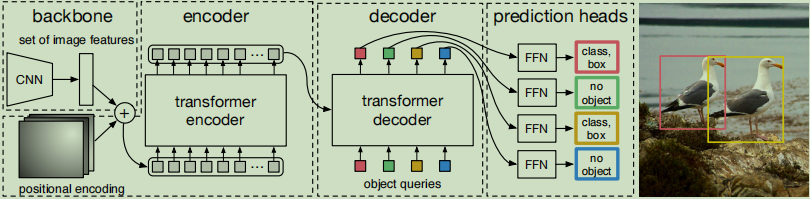

# DETR

## 一、Introduction

### 1、DETR的目标

> The goal of object detection is to predict a set of bounding boxes and category labels for each object of interest.

DETR（Detection Transformer）是一种用于目标检测（Object Detection）的模型，该模型在2020年由Facebook AI Research（FAIR）提出。DETR的主要贡献在于，它使用Transformer架构来解决目标检测问题，从而避免了传统目标检测算法中常见的一些复杂性，如锚框（anchor boxes）、非极大值抑制（NMS）等。

### 2、主要构成

1. **Backbone Network**: 通常使用ResNet或其他卷积神经网络作为基础网络，用于提取图像特征。
2. **Transformer Encoder-Decoder**: 在图像特征的基础上，使用Transformer的编码器-解码器结构进行目标检测。
3. **Bipartite Matching Loss**: 这是一个新颖的损失函数，用于在训练期间匹配预测框和真实框。

### 3、优点

1. **简单性**: 不需要复杂的锚框和NMS步骤。
2. **端到端训练**: 整个模型可以一次性、端到端地进行训练。
3. **可扩展性**: 可以容易地扩展到其他视觉任务。

### 4、缺点

1. **速度**: 由于Transformer的复杂性，模型的推理速度可能不如一些更简单的模型。
2. **训练成本**: 需要大量的计算资源。

## 二、损失函数

DETR（Detection Transformer）使用了一种名为“Bipartite Matching Loss”的特殊损失函数，这是其与传统目标检测算法最显著的不同之一。

### Bipartite Matching Loss

这个损失函数主要由两部分组成：分类损失（Classification Loss）和位置损失（Localization Loss）。

1. **分类损失**: 通常使用交叉熵损失（Cross-Entropy Loss）来计算每个预测框的分类损失。

2. **位置损失**: 用于计算预测框和实际框（Ground Truth）之间的位置偏差，通常使用L1损失或者其他形式的回归损失。

### 匹配机制

在计算损失之前，需要将预测的目标框与实际的目标框进行匹配。这里使用了一种全局的二分匹配算法（Bipartite Matching Algorithm）。

1. **成本矩阵**: 首先计算一个成本矩阵，其中每个元素表示一个预测框与一个实际框之间的“距离”。这个距离是由分类损失和位置损失共同决定的。

2. **最优匹配**: 使用匈牙利算法（Hungarian Algorithm）或其他优化算法找到成本矩阵的最优匹配。

3. **损失计算**: 只有匹配的预测框和实际框之间的损失会被计算并反向传播。未匹配的预测框会被认为是“背景”，其分类损失会被设置为与背景类的交叉熵损失。

### 优点和缺点

#### 优点

1. **全局优化**: 由于使用了全局匹配，模型能够在整个图像范围内进行优化，而不是局限于单个锚框或者预测框。

2. **简单直观**: 不需要复杂的非极大值抑制（NMS）或者锚框策略。

#### 缺点

1. **计算复杂性**: 匹配算法通常需要O(N^3)的时间复杂性，这可能在有大量目标框的情况下成为瓶颈。

2. **对异常值敏感**: 如果模型预测出大量错误的目标框，可能会影响匹配算法的性能。

## 三、详细结构



- **backbone**：主干网络，从图像中抽取特征
- **encoder**：对主干网络输出的特征和位置编码相加后的序列进行进一步处理
- **decoder**：将 decoder 的输出特征和 `object queries` 进行 cross attention，预测目标的类别和位置
- **prediction heads**：进行 FFN 处理后输出目标类别和预测框

## 四、Codes

```py
import torch
from torch import nn
from torchvision.models import resnet50

class DETR(nn.Module):
	def __init__(self, num_classes, hidden_dim, nheads,num_encoder_layers, num_decoder_layers):
 		super().__init__()
        # We take only convolutional layers from ResNet-50 model
        self.backbone = nn.Sequential(*list(resnet50(pretrained=True).children())[:-2])
        self.conv = nn.Conv2d(2048, hidden_dim, 1)
        self.transformer = nn.Transformer(hidden_dim, nheads,
        								  num_encoder_layers, num_decoder_layers)
        self.linear_class = nn.Linear(hidden_dim, num_classes + 1)
        self.linear_bbox = nn.Linear(hidden_dim, 4)
        self.query_pos = nn.Parameter(torch.rand(100, hidden_dim))
        self.row_embed = nn.Parameter(torch.rand(50, hidden_dim // 2))
        self.col_embed = nn.Parameter(torch.rand(50, hidden_dim // 2))

 	def forward(self, inputs):
        x = self.backbone(inputs)
        h = self.conv(x)
        H, W = h.shape[-2:]
        pos = torch.cat([
        	self.col_embed[:W].unsqueeze(0).repeat(H, 1, 1),
        	self.row_embed[:H].unsqueeze(1).repeat(1, W, 1),
        ], dim=-1).flatten(0, 1).unsqueeze(1)
        h = self.transformer(pos + h.flatten(2).permute(2, 0, 1),
        					 self.query_pos.unsqueeze(1))
        return self.linear_class(h), self.linear_bbox(h).sigmoid()

detr = DETR(num_classes=91, hidden_dim=256, nheads=8, num_encoder_layers=6, num_decoder_layers=6)
detr.eval()
inputs = torch.randn(1, 3, 800, 1200)
logits, bboxes = detr(inputs)
```

## 五、Problems

### 1、为什么DETR不需要nms

每个 object query 代表一个预测目标，由于经过了 transformer 处理，使得每个 object query 能够获取其他 object query 的信息，尽量避免对相同目标进行预测。