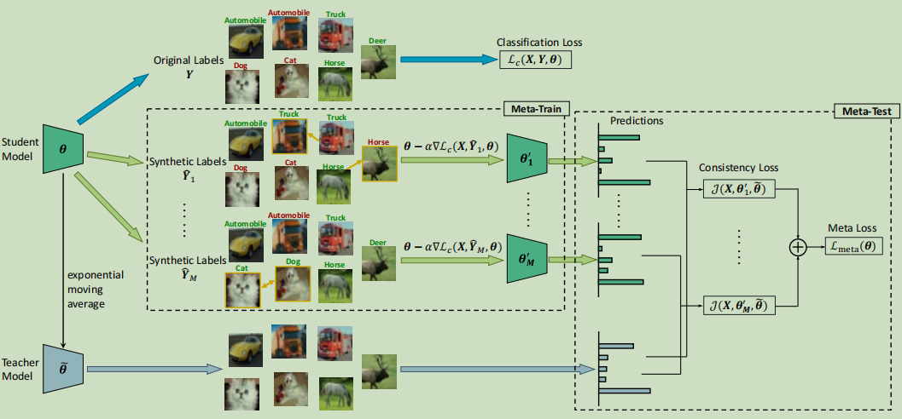
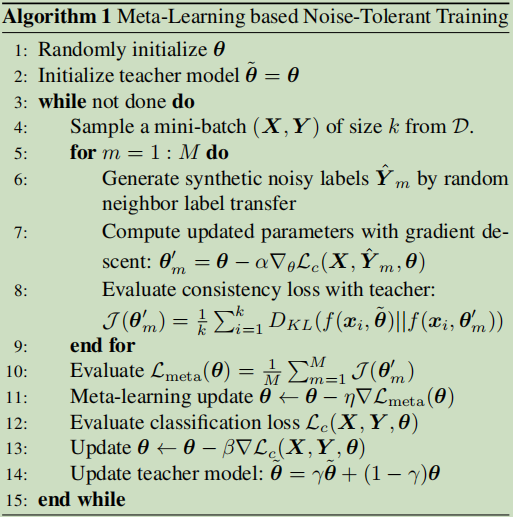

# Learning to Learn from Noisy Labeled Data

## 一、Introduction

> Training on noisy labeled datasets causes performance degradation because DNNs can easily overfifit to the label noise. To overcome this problem, we propose a noise-tolerant training algorithm, where a meta-learning update is performed prior to conventional gradient update.

**目的**

论文的目的是提出一种基于元学习的方法，可以从带有噪声标签的数据中学习鲁棒的特征表示和分类模型，而不需要任何人工干预或清洗数据。

**方法**

论文的方法是在每个小批量数据上，生成一些合成的噪声标签，然后用这些噪声标签对模型进行梯度更新，同时用一个教师模型来指导学生模型，使得学生模型在不同的噪声标签下都能给出一致的预测结果。

**创新点**

论文的创新点是提出了一个元学习目标，即训练模型使得它在经过一次梯度更新后不会过拟合噪声标签，而是能够捕捉到数据的真实特征。论文还提出了一个双重对比学习的框架，利用正负样本对来增强模型的判别能力。

**核心思想**

> 论文的核心思想是：`a noise-tolerant model should be able to consistently learn the underlying knowledge from data despite different label noise.`

### 1、相似工作

大多数工作是拟合一个模型，来近似噪声和真实标签的分布。

但这种方式通常需要纯净的标签集合，并且如果噪声分布复杂，很难有效地进行拟合。

## 二、Method

考虑有训练集：$D = {(x_1, y_1 ), ...,(x_n, y_n)}$

其中，$x_i$ 代表第 i 个样本，$y_i \in \{0, 1\}^c$ 是 c 个类别上相应的带噪声的标签

1. consider a mini-batch of data (X, Y) sampled from the training set, where $X = \{x_1, ..., x_k\}$ are *k* samples, and

   $Y = \{y_1, ...,y_k\}$ are the corresponding noisy labels

2. randomly select ρ samples out of the mini-batch of k samples, randomly select a neighbor $x_j$ from its top 10 nearest neighbors, use the neighbor’s label $y_j$ to replace the label for $x_i, \hat{y_i}^m = y_i$

3. repeat the above procedure M times to generate M mini-batches of synthetic noisy label

4. $\theta_m' = \theta - \alpha \nabla_\theta L_c(X, \hat{Y}_m, \theta)$​，其中 $L_c = -\frac{1}{n}\sum_{i=1}^n y_i \cdot \log(f(x_i, \theta))$

