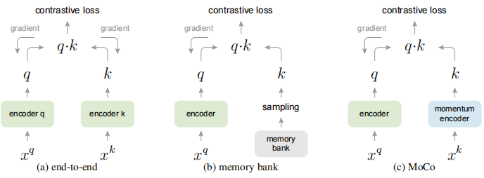

# Moco

## 一、Introduction

> We present Momentum Contrast (MoCo) for unsupervised visual representation learning. From a perspective on contrastive learning as dictionary look-up, we build a dynamic dictionary with a queue and a moving-averaged encoder.

### 1、Present situation

近些年，无监督学习在 nlp 领域获得了巨大的成果，但在 cv 领域仍和监督学习存在较大差距。

作者认为，这种差距在于它们属于不同的信号空间。

语言任务是在离散的信号空间，可以简单地构造出字典，这是用于无监督学习的基础。而图片任务是在连续的、高维的空间中，它更关注如何构建字典。

### 2、Related works

**对比学习**

一部分很有希望的研究是基于对比学习的。这些研究大体可以总结为以下方法：

1. 建立一个字典
2. 字典的 `key` 是从样本中采样，然后经过 `encoder` 编码而来的
3. 训练 `encoder` 使得 `query` 编码和它所匹配的样本 `key` 接近，而和其他 `key` 远离

### 3、Moco

和以往的对比学习不同的是，Moco用一个队列作为存储 `key` 的字典，当队列满后，新的 `mini-batch` 进来，旧的 `mini-batch` 出去。

除此之外，由于字典规模大，encoder要学习的参数多，导致不能采用常规的 `BP` 方式进行学习，`moco` 采用了动量下降的方式进行学习，这一部分动量来自于 `query encoder`。

#### 1、training



上图列举了三种对比损失机制：

- 第一种使用 `BP` 算法进行端到端的更新
- 第二种是从 `memory bank` 中采样 `key`
- moco 采用动量更新的 `encoder` 来产生 `key`，并维护一个队列来存储 `key`

## 二、Coding

```py
# f_q, f_k: encoder networks for query and key
# queue: dictionary as a queue of K keys (CxK)
# m: momentum
# t: temperature
f_k.params = f_q.params # initialize
for x in loader: # load a minibatch x with N samples
x_q = aug(x) # a randomly augmented version
x_k = aug(x) # another randomly augmented version
q = f_q.forward(x_q) # queries: NxC
k = f_k.forward(x_k) # keys: NxC
k = k.detach() # no gradient to keys
# positive logits: Nx1
l_pos = bmm(q.view(N,1,C), k.view(N,C,1))
# negative logits: NxK
l_neg = mm(q.view(N,C), queue.view(C,K))
# logits: Nx(1+K)
logits = cat([l_pos, l_neg], dim=1)
# contrastive loss, Eqn.(1)
labels = zeros(N) # positives are the 0-th
loss = CrossEntropyLoss(logits/t, labels)
# SGD update: query network
loss.backward()
update(f_q.params)
# momentum update: key network
f_k.params = m*f_k.params+(1-m)*f_q.params
# update dictionary
enqueue(queue, k) # enqueue the current minibatch
dequeue(queue) # dequeue the earliest minibatch
```

## 三、Problems

### 1、Batch Normalization

正如标准的 resnet 一样，$f_q$ 和 $f_k$ 都存在 BN 操作，而 BN 会计算样本的`方差`和`均值`，这些被称为泄露信息。

通过这些泄露的信息，编码器能够很容易找到正样本，而非去学习一个好的模型。

**BN操作**

1. **计算均值和方差**：对于每一个小批量（batch）的数据，计算其特征的均值和方差。
   $$
   μ = \frac{1}{m} \sum_{i=1}^{m} x_i, \sigma^2 = \frac{1}{m} \sum_{i=1}^{m} (x_i - \mu)^2
   $$

2. **归一化**：使用计算出的均值和方差来归一化每个数据点。
   $$
   \hat{x}_i = \frac{x_i - \mu}{\sqrt{\sigma^2 + \epsilon}}
   $$
   其中，$\epsilon$ 是一个非常小的数（例如 $1e-7$），用于防止分母为零。

3. **缩放和平移**：归一化后的数据会被缩放（scale）和平移（shift）。
   $$
   y_i = \gamma \hat{x}_i + \beta
   $$
   其中，$\gamma$ 和 $\beta$ 是可学习的参数。

**原理**

由于最后一步加上了缩放和平移，并交由神经网络进行学习，神经网络因此可根据 BN 操作的效益来决定缩放平移值的大小。

如果归一化操作效果不好，则可以通过更改缩放平移值来抵消部分归一化的操作。

### 2、Why dictionary

> a larger dictionary may better sample the underlying continuous, high dimensional visual space, while the keys in the dictionary should be represented by the same or similar encoder so that their comparisons to the query are consistent

使用一个队列可以让字典的规模很大，但同时也让 `encoder` 变得难以训练。因为梯度下降会将梯度冒泡到全部样本。

传统的一个解决方法是直接将 `query encoder` 作为 `key encoder`。但实际上，这种方法表现并不好，作者认为，是因为 `encoder` 变化的太快，导致字典中的 `key` 丧失了一致性。

因此，moco 提出了动量更新的方式：
$$
\theta_k \leftarrow m\theta_k + (1-m)\theta_q
$$
其中，$m \in [0,1)$ 是动量系数，只有 $\theta_q$ 是需要进行 `BP` 的。

尽管队列中的 `key` 可能是不同编码器产生的，这些编码器的差异也很小（如取 m = 0.999）
