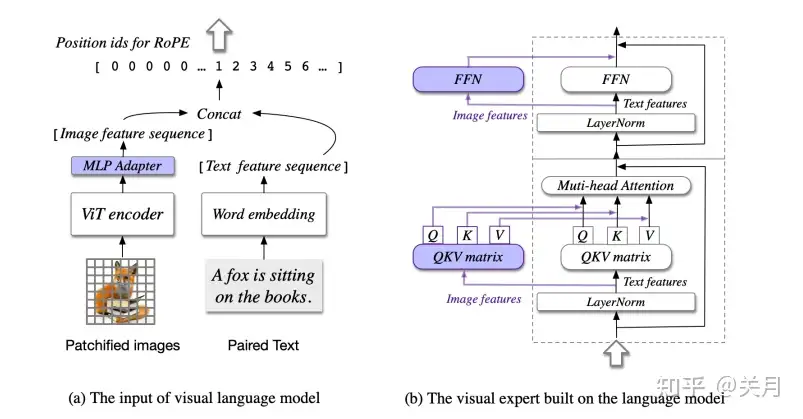
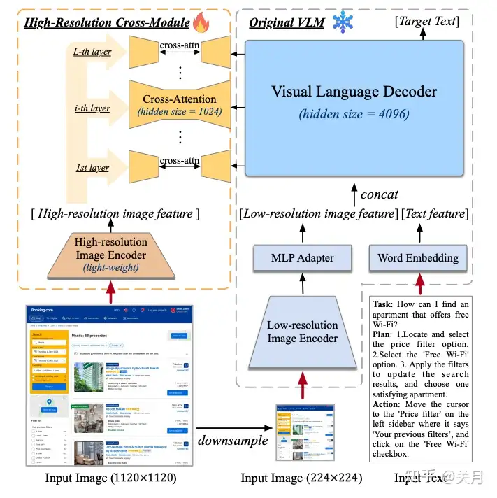
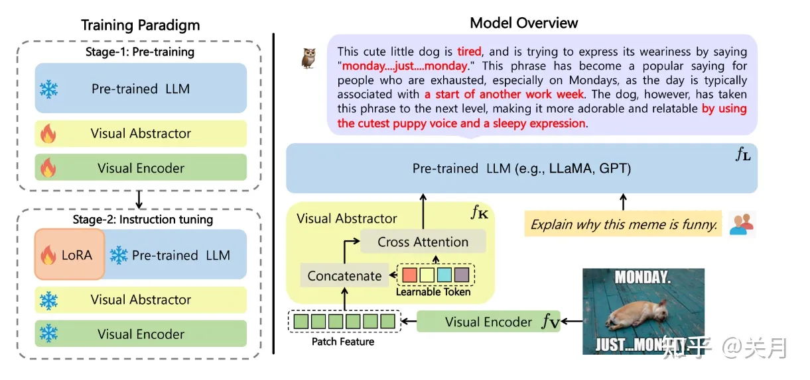

# OCR-free

## 一、Donut

> 论文地址：[OCR-free Document Understanding Transformer](https://link.zhihu.com/?target=https%3A//readpaper.com/paper/4563989181315948545)
>
> 作者机构：NAVER CLOVA
>
> 发表时间：2022
>
> 发表情况：ECCV 2022
>
> 代码仓库：[https://github.com/clovaai/donu](https://link.zhihu.com/?target=https%3A//github.com/clovaai/donut)

|      | OCR-Base                                                     | OCR-Free                         |
| ---- | ------------------------------------------------------------ | -------------------------------- |
| 优点 | 性能高                                                       | 端到端训练； 对OCR结果校正依赖小 |
| 缺点 | 使用OCR的计算成本高; OCR模型在语言或文档类型上缺乏灵活性; OCR误差传播到后续过程。 | 性能差； 需要联合优化；          |

Donut的训练采用了预训练和微调方案。在预训练阶段，Donut 通过结合图像和之前的文本上下文来预测下一个单词，从而学习如何阅读文本。在微调阶段，Donut 根据下游任务学习如何理解整个文档。

Donut 是一个端到端的VDU模型，用于对文档图像进行一般理解。Donut的架构非常简单，它由基于 Transformer 的视觉 Encoder 和文本 Decoder 模块组成。Donut 不依赖于任何与OCR功能相关的模块，而是使用视觉 Encoder 从给定的文档图像中提取特征。下面的文本 Decoder 将派生的特征映射到子词 token 序列中，以构建所需的结构化格式（例如JSON）。

## 二、Nougat

> **原文：**Nougat： Neural Optical Understanding for Academic Documents
>
> **作者：**Lukas Blecher∗ Guillem Cucurull Thomas Scialom, MetaAI
>
> **代码：**[https://github.com/facebookresearch/nougat](https://link.zhihu.com/?target=https%3A//github.com/facebookresearch/nougat)
> [https://github.com/allenai/s2or](https://link.zhihu.com/?target=https%3A//github.com/allenai/s2orc)

Nougat 和 Donut 一样，是标准的 `Encoder-Decoder` 架构。

**Encoder** 用的是 `20层` （Swin-B `{2, 2, 14, 2}`）的 **[Swin Transformer](https://link.zhihu.com/?target=https%3A//arxiv.org/abs/2103.14030)**。

**Decoder** 用的是文字生成模型 mBART 中decoder，可以看成比较标准的 transformer decoder。

该篇工作基于Donut，整个网络结构都是来自Donut。因此该篇工作的主要贡献不在算法侧，而是在于数据侧，主要有以下三点：

1. 训练了pre-trained model，可以转换`PDF`到轻量的`mardown`格式，包括PDF中表格和公式；

2. 通过构造了一个完整pipeline，来构造一个将PDF转换为对应MMD格式的数据集；
3. 该方法其输入仅仅是图像，且能够处理扫描的论文和书籍；

## 三、Pix2Struct

> code: https://github.com/google-research/pix2struct

该篇工作主要是将网页上masked screenshots转换简单的HTML代码，示例图如上面所示，第一行是模型的输入，第二行是模型对应的输出结果。

模型的结构是基于ViT的图像编码器加文本解码器，对于模型的输入进行了一些改变以适应各种分辨率的图像输入。传统ViT会将输入图像缩放到定义好的分辨率，如下面左图所示，这会带来两个缺点，首先是图像中的文字、ui会发生畸变，这不利于对这些元素的识别。其次就是预训练阶段只观察到一个特定的分辨率，之后迁移到一些需要更高分辨率的下游任务是很困难的。
但是作者这里对ViT输入做了一些改进，首先等比例缩放图像，保证固定尺寸的patch个数能够达到最大序列长度，之后使用二维绝对位置嵌入。这样有两个好处，首先可以应对极端的图像长宽比，其次可以实时修改序列长度和分辨率。

## 四、Vary

该篇工作着眼于`dense and fine-grained vision perception`任务，例如文档级别OCR和图表理解任务。这一点和Nougat工作有些类似。论文主要可分为两个阶段：

1. 设计一个`vocabulary network`，通过自回归的方式产生所需要的vocabulary
2. 将上一阶段的new vocabulary与LLM中现有的vanilla vision vocabulary融合，使得LLM获得新的能力。

因为在第一阶段训练Vary-tiny时，image encoder用的是在`ViTDet`上训练所得`SAM-base`模型，所以其输入图像尺寸是1024x1024x3。这一点可以有效缓解文档类图像在较小尺寸下输入，文字模糊变形问题。但是并未从实际上提高模型的输入尺寸。

## 五、Unidoc

> 论文地址：[UniDoc: A Universal Large Multimodal Model for Simultaneous Text Detection, Recognition, Spotting and Understanding](https://arxiv.org/abs/2308.11592)

UniDoc是一个可以同时做文本检测、文本识别和文档理解的多模态模型。

如图所示，UniDoc 将文本检测、识别、spotting 以及多模态理解等任务，在多模态指令微调框架中实现了统一。具体来说，输入图像和指令（例如检测、识别、spotting或语义理解）后，UniDoc 会从图像中提取视觉和文本信息，并基于大型语言模型的知识库，结合指令内容完成回答。

1. 以 CLIP 为编码器，将`图像I`抽象为视觉特征图
2. 将视觉特征图展平为`sequence`，并将其投影到LLM的嵌入维度中，输出 $E_v$
3. 将`语言指令Q`转为序列 $E_l$
4. 将 $E_v$ 和 $E_l$ 拼接，并送到 `Vicuna` 中
5. `Vicuna` 根据收到的视觉和文本提示生成响应

训练总共分两个阶段：

在预训练阶段，冻结视觉和语言模型，只训练 `Projector`。

在微调阶段，解冻所有模型。

## 六、CogVLM

整体结构在LLaVA的基础上在大语言模型中每层都添加了一个可训练的视觉专家模块（右图），以实现图像特征和文本特征的深度对齐，而不会牺牲任何NLP任务的性能。只有紫色部分是可训练的。

**训练**

训练和LLaVA同样分为两个阶段：
第一阶段：预训练阶段；使用了数据集LAION-2B和COYO-700M，加上4M的视觉定位数据集（LAION-400M的子集）。预训练阶段也分为两个训练任务（文本下一个Token预测和REC任务）。REC任务是指给我图片中目标的标书，预测Bounding Box的任务。在这个阶段**冻结了VIT和语言模型原本的参数**，可训练的参数为6.5B。

第二阶段：微调；数据来源于LLaVA-Instruct（GPT4生成，手动纠正了该数据集中的错误）、LRV-Instruction、LLaVAR和内部数据集。在该阶段，除了ViT Encoder，其它参数都是可训练的。

## 七、CogAgent

在CogVLM的基础上添加了一个高分辨率的图片编码器模块（High-resolution image feature），解决了CogVLM对高分辨图片支持弱的问题, 可以集成到各种视觉语言模型架构中。

**训练**

- 预训练阶段

  训练主要分为三个任务：**文本识别、视觉定位和GUI图像理解**（指网页等GUI图像的理解能力）。

  - **文本识别**任务数据集主要来自合成的文本图像(80M)、自然图像OCR(18M)、学术文档（9M、arXiv）。
  - **视觉定位**数据集：LAION-115M中得到的40M数据, 一个图像+对应的描述 比如A bluebird [[302,413,640,752]]sitting on abranch coffee mugs [[279,588,677,804]]。
  - **GUI图像理解：**GUI指代表达生成、GUI指代表达理解**。**

  预训练也分为两个阶段，第一阶段只训练新添加的High-Resolution Cross-Module（参数约为646M）；第二阶段训练High-Resolution Cross-Module和视觉专家模块。在预训练阶段会根据任务的难度按照递增的顺序进行训练，可以令模型收敛快并且训练稳定。

- 微调阶段

  数据集包含多个公开的视觉问答数据集、Mind2Web、AITW等。

  在这个阶段所有模型均可以参与微调。

## 八、mPlug-Owl

> Arxiv：[https://arxiv.org/abs/2304.1417](https://arxiv.org/abs/2304.1417)

mPLUG-Owl的模型结构如上图所示，输入一张图片，经过一个Visual Encoder(对图像编码)和Visual Abstractor（将较长的、细粒度的图像特征概括为少量可学习的 Token，实现对视觉信息的高效建模) ，然后生成的视觉 Token和文本查询送到大语言模型获取输出。

**训练**

- 第一阶段：使用多模态数据训练视觉模块（冻结语言模块），可以让视觉特征贴合语言特征。
- 第二阶段：使用多模态和单模态数据联合调整语言模块的LoRA参数，冻结视觉模块。模型可以学习多样化的单模态和多模态指令，同时具备单模态和多模态多轮对话能力。

不同于LLaVA，mPLUG-Owl使用类似Blip中的Q-Former结构进行视觉特征提取，提取到的特征的维度同Query的维度相同（维度太小），会造成信息损失。

## 九、mPLUG-DocOwl

已有的多模态大模型在未经领域训练的情况下，往往会忽略细粒度的`OCR 特征`，例如复杂的表格、或是大的文本块等。

例如，现有的模型大致分为两种：基于现成的OCR模型、以及end-to-end的模型。然而，两种方法都需要在特定数据集上进行微调，促进图像和文本之间的跨模态对齐，无法达到大语言模型的`开放域指令理解`的能力（即模型能够理解来自各种不同来源和背景的指令或请求，而不仅仅局限于某一特定领域或数据集）。

mPLUG-DocOwl是在mPLUG-Owl基础上，基于统一的instruction tuning，来平衡`language-only`, `general vision-and-language`和`document understanding`三个任务。

**训练**

mPLUG-DocOwl收集了具有不同任务格式的各种文档理解数据集，包括**视觉问答（VQA），信息提取（IE），自然语言推理（NLI）和图像字幕（IC）**。mPLUG-Owl 以统一格式执行指令调优，即“Human：{question} AI：{answer}”。通过替换 {question} 和 {answer} 占位符，将不同的文档理解任务转换为与 mPLUG-Owl 相同的格式。

- **第一阶段：**初始化于mPLUG-Owl，为了增强模型的文字理解能力，mPLUG-DocOwl第一阶段只采用新构建的带文字图片相关的指令数据集进行微调，训练结构包括visual abstractor和LLM中的LoRA。
- **第二阶段**：为了保持Owl的开放域图文理解以及指令理解能力，mPLUG-DocOwl第二阶段进一步添加Owl的指令微调数据进行混合训练，只训练LLM中的LoRA。
- 
