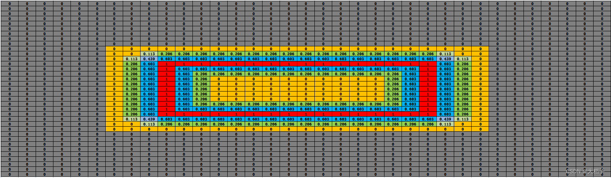

# DBNet

原文链接：https://blog.csdn.net/yewumeng123/article/details/127503815

> DBNet是基于分割的文本检测算法，算法将可微分二值化模块(Differentiable Binarization)引入了分割模型，使得模型能够通过自适应的阈值图进行二值化，并且自适应阈值图可以计算损失，能够在模型训练过程中起到辅助效果优化的效果。经过验证，该方案不仅提升了文本检测的效果而且简化了后处理过程。相较于其他文本检测模型，DBNet在效果和性能上都有比较大的优势，是当前常用的文本检测算法。
>

## 一、模型结构

DB文本检测模型可以分为三个部分：

- Backbone网络：负责提取图像的特征
- FPN网络：特征金子塔，结构增强特征
- Head网络：计算文本区域概率图

### 1.1、Baackbone网络

DB文本检测网络的Backbone部分采用的是图像分类网络，论文中分别使用了ResNet50和ResNet18网络。

输入图像[1，3，640, 640] ，进入Backbone骨架网络，先经过一次卷积计算尺寸变为原来的1/2， 而后经过四次下采样，输出四个尺度特征图如下：

### 1.2、FPN网络

FPN网络用于高效提取图片中各维度特征。

FPN网络的输入为Backbone部分的输出，经FPN计算后输出的特征图的高度和宽度为原图的1/4, 即[1, 256, 160, 160]。

### 1.3、Head网络

计算文本区域概率图，文本区域阈值图以文本区域二值图。

Head网络会在FPN特征的基础上作上采样，将FPN特征由原来的1/4大小映射到原图大小，最终将生成的三个图合并，输出为[1, 3, 640, 640]。

## 二、标签生成

DB算法在进行模型训练的时，需要根据标注框生成两幅图像：概率图和阈值图。

image图像中的红线是文本的标注框，文本标注框的点集合用如下形式表示:
$G=\left\{S_k\right\}_{k=1}^n, \quad \mathrm{n}$ 表示顶点的数量。

在polygon图像中，将红色的标注框外扩distance得到绿色的polygon框，内缩distance得到蓝色的polygon框。

论文中标注框内缩和外扩使用相同的distance,其计算公式为:
$D=\frac{A\left(1-r^2\right)}{L}$, L代表周长，A代表面积，r代表缩放比例,通常 $\mathrm{r}=0.4$。

多边形轮廓的周长L和面积 $A$ 通过Polygon库计算获得。根据计算出的distance，对标注框进行外扩和内缩操作，用Vatti算法实现。

### 2.1、概率图标签

使用收缩的方式获取算法训练需要的概率图标签。标注框内缩后，覆盖区域的概率值为1，其余区域概率值为0。

### 2.2、阈值图标签

阈值图中，需计算各位置到标注框的距离，距离越近的位置，阈值越高。

用1减去距离归一化的值，即获取到阈值图。靠近标注框的位置，阈值接近1。

