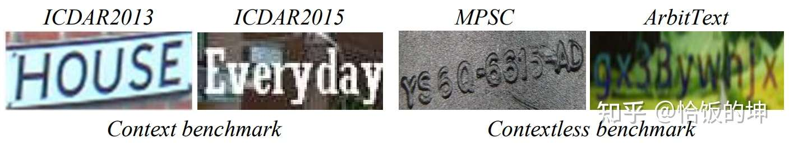
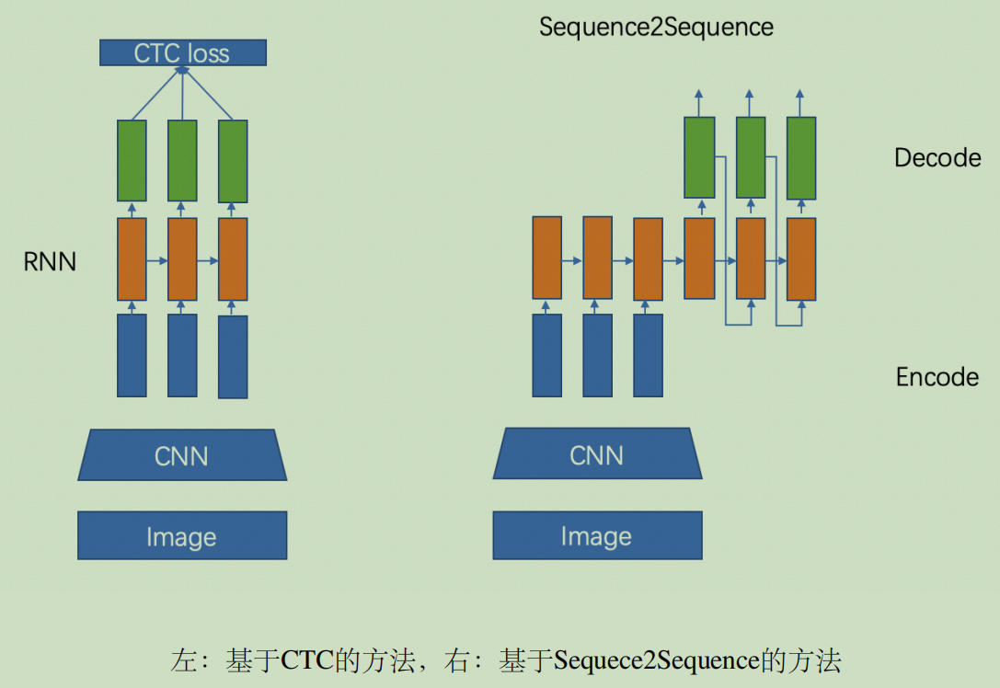
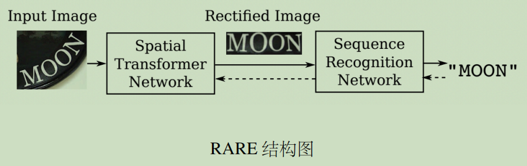
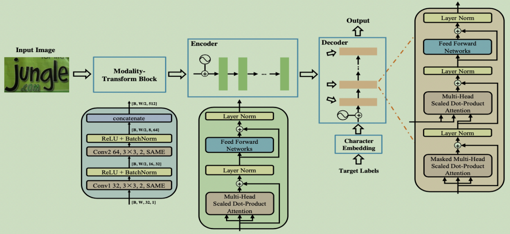
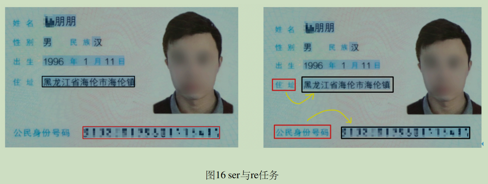

# 文本识别

## 一、背景

现有的文本实例主要分为两类：有序文本（context texts）和 无序文本（contextless texts)

近期的一些工作往往聚焦于识别有序文本，包括但不限于，language-free methods and language-aware methods.

**对于language-aware methods**, 主要利用语言模型去解决语义上下文的问题。

比如当视觉模型（language-free model）识别出"univers**l**ty", 语言模型可以很好地解决视觉识别错误，得到"univers**i**ty"。但语言模型存在的问题有以下两点：

1. 语言模型需要联合视觉模型的输出，通过优化字符预测的联合分布，得到好的精度。然而当将wiki语料库正确的单词送给单一的语言模型时，其精度只有50%左右。语言模型的能力还有待提升。
2. 语言模型不能够很好地泛化到任意文本上，比如无序文本。

如果想要识别任意的文本（有序文本和无序文本），language-free method是首要选择。

而视觉模型的核心在于，将文本识别看成字符级的分类任务，主要利用视觉信息去识别每个字符。

## 二、文本检测

> 文本检测的任务是定位出输入图像中的文字区域。

目前较为流行的文本检测算法可以大致分为**基于回归**和**基于分割**的两大类文本检测算法，也有一些算法将二者相结合。

- 基于回归的算法借鉴通用物体检测算法，通过设定anchor回归检测框，或者直接做像素回归，这类方法对规则形状文本检测效果较好，但是对不规则形状的文本检测效果会相对差一些，比如CTPN[3] 对水平文本的检测效果较好，但对倾斜、弯曲文本的检测效果较差，SegLink[8] 对长文本比较好，但对分布稀疏的文本效果较差；
- 基于分割的算法引入了Mask-RCNN[9]，这类算法在各种场景、对各种形状文本的检测效果都可以达到一个更高的水平，但缺点就是后处理一般会比较复杂，因此常常存在速度问题，并且无法解决重叠文本的检测问题。

**文本检测和目标检测的差异**

- 目标检测：给定图像或者视频，找出目标的位置（box），并给出目标的类别；
- 文本检测：给定输入图像或者视频，找出文本的区域，可以是单字符位置或者整个文本行位置；

## 三、文本识别

> 文本识别的任务是识别出图像中的文字内容，一般输入来自于文本检测得到的文本框截取出的图像文字区域。

文本识别一般可以根据待识别文本形状分为**规则文本识别**和**不规则文本识别**两大类。

- 规则文本主要指印刷字体、扫描文本等，文本大致处在水平线位置；
- 不规则文本往往不在水平位置，存在弯曲、遮挡、模糊等问题。不规则文本场景具有很大的挑战性，也是目前文本识别领域的主要研究方向。

文本识别的主流算法有两种，分别是基于 CTC (Conectionist Temporal Classification) 的算法和 Sequence2Sequence 算法，区别主要在解码阶段。

### 3.1、规则文本

#### （1）基于 CTC 的算法

基于 CTC 最典型的算法是CRNN (Convolutional Recurrent Neural Network)[1]，它的特征提取部分使用主流的卷积结构，常用的有ResNet、MobileNet、VGG等。由于文本识别任务的特殊性，输入数据中存在大量的上下文信息，`卷积神经网络的卷积核特性使其更关注于局部信息，缺乏长依赖的建模能力`，因此仅使用卷积网络很难挖掘到文本之间的上下文联系。

为了解决这一问题，CRNN文本识别算法`引入了双向 LSTM(Long Short-TermMemory) 用来增强上下文建模`，通过实验证明双向LSTM模块可以有效的提取出图片中的上下文信息。最终将输出的特征序列输入到CTC模块，直接解码序列结果。该结构被验证有效，并广泛应用在文本识别任务中。Rosetta[2] 是FaceBook提出的识别网络，由全卷积模型和CTC组成。Gao Y[3] 等人使用CNN卷积替代LSTM，参数更少，性能提升精度持平。

#### （2）Sequence2Sequence 算法

Sequence2Sequence 算法是`由编码器 Encoder 把所有的输入序列都编码成一个统一的语义向量，然后再由解码器Decoder解码`。

在解码器Decoder解码的过程中，不断地将前一个时刻的输出作为后一个时刻的输入，循环解码，直到输出停止符为止。

一般编码器是一个RNN，对于每个输入的词，编码器输出向量和隐藏状态，并将隐藏状态用于下一个输入的单词，循环得到语义向量；解码器是另一个RNN，它接收编码器输出向量并输出一系列字以创建转换。

受到 Sequence2Sequence 在翻译领域的启发，Shi[4] 提出了一种基于注意的编解码框架来识别文本,通过这种方式，rnn能够从训练数据中学习隐藏在字符串中的字符级语言模型。

以上两个算法在规则文本上都有很不错的效果，但由于网络设计的局限性，这类方法很难解决弯曲和旋转的不规则文本识别任务。为了解决这类问题，部分算法研究人员在以上两类算法的基础上提出了一系列改进算法。

### 3.2、不规则文本

不规则文本识别算法可以被分为4大类：基于校正的方法；基于 Attention 的方法；基于分割的方法；基于 Transformer 的方法。

#### （1）基于校正的方法

> 基于校正的方法利用一些视觉变换模块，`将非规则的文本尽量转换为规则文本，然后使用常规方法进行识别`。

RARE[4] 模型首先提出了对不规则文本的校正方案，整个网络分为两个主要部分：一个空间变换网络STN(Spatial Transformer Network) 和一个基于Sequence2Squence的识别网络。

其中STN就是校正模块，不规则文本图像进入STN，通过TPS(Thin-Plate-Spline)变换成一个水平方向的图像，该变换可以一定程度上校正弯曲、透射变换的文本，校正后送入序列识别网络进行解码。

#### （2）基于Attention的方法

> 基于 Attention 的方法主要关注的是序列之间各部分的相关性，该方法最早在机器翻译领域提出，认为在文本翻译的过程中当前词的结果主要由某几个单词影响的，因此需要给有决定性的单词更大的权重。在文本识别领域也是如此，将编码后的序列解码时，每一步都选择恰当的context来生成下一个状态，这样有利于得到更准确的结果。

R^2AM [7] 首次将 Attention 引入文本识别领域，该模型首先`将输入图像通过递归卷积层提取编码后的图像特征`，然后`利用隐式学习到的字符级语言统计信息通过递归神经网络解码输出字符`。`在解码过程中引入了 Attention 机制`实现了软特征选择，以更好地利用图像特征，这一有选择性的处理方式更符合人类的直觉。

#### （3）基于分割的方法

> 基于分割的方法是将文本行的各字符作为独立个体，相比与对整个文本行做矫正后识别，识别分割出的单个字符更加容易。

它试图从输入的文本图像中定位每个字符的位置，并应用字符分类器来获得这些识别结果，将复杂的全局问题简化成了局部问题解决，在不规则文本场景下有比较不错的效果。然而这种方法需要字符级别的标注，数据获取上存在一定的难度。

Lyu[9] 等人提出了一种用于单词识别的实例分词模型，该模型在其识别部分使用了基于 FCN(Fully Convolutional Network) 的方法。[10] 从二维角度考虑文本识别问题，设计了一个字符注意FCN来解决文本识别问题，当文本弯曲或严重扭曲时，该方法对规则文本和非规则文本都具有较优的定位结果。

#### （4）基于Transformer的方法

> 一部分文本识别算法使用 Transformer 的 Encoder 结构和卷积共同提取序列特征，Encoder 由多个 MultiHeadAttentionLayer 和 Positionwise Feedforward Layer 堆叠而成的block组成。MulitHeadAttention 中的 self-attention利用矩阵乘法模拟了RNN的时序计算，打破了RNN中时序长时依赖的障碍。也有一部分算法使用 Transformer的 Decoder 模块解码，相比传统RNN可获得更强的语义信息，同时并行计算具有更高的效率。

SRN[11] 算法将Transformer的Encoder模块接在ResNet50后，增强了2D视觉特征。并提出了一个并行注意力模块，将读取顺序用作查询，使得计算与时间无关，最终并行输出所有时间步长的对齐视觉特征。此外SRN还利用Transformer的Eecoder作为语义模块，将图片的视觉信息和语义信息做融合，在遮挡、模糊等不规则文本上有较大的收益。

NRTR[12] 使用了完整的Transformer结构对输入图片进行编码和解码，只使用了简单的几个卷积层做高层特征提取，在文本识别上验证了Transformer结构的有效性。

SRACN[13] 使用Transformer的解码器替换LSTM，再一次验证了并行训练的高效性和精度优势。

## 四、文档结构化识别

> 传统意义上的OCR技术可以解决文字的检测和识别需求，但在实际应用场景中，最终需要获取的往往是结构化的信息，如身份证、发票的信息格式化抽取，表格的结构化识别等等，多在快递单据抽取、合同内容比对、金融保理单信息比对、物流业单据识别等场景下应用。OCR结果+后处理是一种常用的结构化方案，但流程往往比较复杂，并且后处理需要精细设计，泛化性也比较差。在OCR技术逐渐成熟、结构化信息抽取需求日益旺盛的背景下，版面分析、表格识别、关键信息提取等关于智能文档分析的各种技术受到了越来越多的关注和研究。

**表格识别**

> 表格识别（Table Recognition）的任务就是将文档里的表格信息进行识别和转换到excel文件中。文本图像中表格种类和样式复杂多样，例如不同的行列合并，不同的内容文本类型等，除此之外文档的样式和拍摄时的光照环境等都为表格识别带来了极大的挑战。这些挑战使得表格识别一直是文档理解领域的研究难点。

表格识别的方法种类较为丰富，早期的`基于启发式规则`的传统算法，如Kieninger[18] 等人提出的T-Rect等算法，一般通过人工设计规则，连通域检测分析处理；近年来随着深度学习的发展，开始涌现一些`基于CNN`的表格结构识别算法，如Siddiqui Shoaib Ahmed[19] 等人提出的DeepTabStR，Raja Sachin[20] 等人提出的TabStructNet等；此外，随着图神经网络（Graph Neural Network）的兴起，也有一些研究者尝试将图神经网络应用到表格结构识别问题上，`基于图神经网络`，将表格识别看作图重建问题，如Xue Wenyuan[21] 等人提出的TGRNet；基于端到端的方法直接使用网络完成表格结构的HTML表示输出，`端到端的方法大多采用Seq2Seq方法`来完成表格结构的预测，如一些基于Attention或Transformer的方法，如TableMaster[22]。

**关键信息提取**

> 关键信息提取（Key Information Extraction，KIE）是Document VQA中的一个重要任务，主要从图像中提取所需要的关键信息，如从身份证中提取出姓名和公民身份号码信息，这类信息的种类往往在特定任务下是固定的，但是在不同任务间是不同的。

KIE通常分为两个子任务进行研究：

- SER: 语义实体识别 (Semantic Entity Recognition)，对每一个检测到的文本进行分类，如将其分为姓名，身份证。如下图中的黑色框和红色框。

- RE: 关系抽取 (Relation Extraction)，对每一个检测到的文本进行分类，如将其分为问题和的答案。然后对每一个问题找到对应的答案。如下图中的红色框和黑色框分别代表问题和答案，黄色线代表问题和答案之间的对应关系。

  