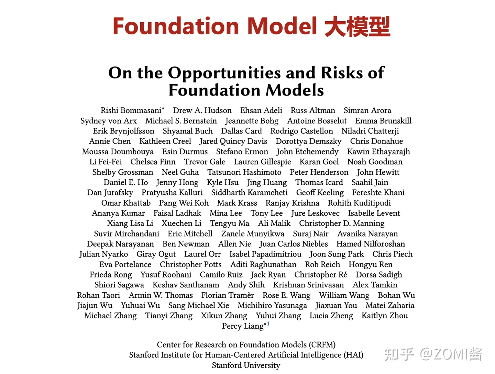

# 大模型

## 一、什么是大模型

2021年8月份，李飞飞和100多位学者联名发表一份200多页的研究报告《On the Opportunities and Risk of Foundation Models》，深度地综述了当前大规模预训练模型面临的机遇和挑战。

在文章中，AI专家将大模型统一命名为Foundation Models，可以翻译为基础模型或者是基石模型。

2017年Transformer结构的提出，使得深度学习模型参数突破了1亿。下面这个图呢，就是从一开始的lenet、Alexnet、ResNet开始，模型参数一个比一个大，到了BERT网络模型的提出，使得参数量首次超过3亿规模，GPT-3模型超过百亿，鹏程盘古实现千亿稠密的规模、Switch Transformer的问世还一举突破万亿规模。

## 二、大模型的发展

## 三、大模型目前面临的问题

### 3.1、通用性问题

虽然深度学习使得很多通用领域的精度和准确率得到很大的提升，但是AI模型目前存在很多挑战，最首要的问题是模型的通用性不高，也就是A模型往往专用于特定A领域，应用到领域B时效果并不好。

由于大模型的训练成本过于昂贵，因此也不可能针对每个领域都重新训练一遍模型。

目前普遍采用的做法是，“预训练大模型+下游任务微调”的方式。大规模预训练可以有效地从大量标记和未标记的数据中捕获知识，通过将知识存储到大量的参数中并对特定任务进行微调，极大地扩展了模型的泛化能力。例如，在NLP领域，预训练大模型共享了预训任务和部分下游任务的参数，在一定程度上解决了通用性的难题，可以被应用于翻译，问答，文本生成等自然语言任务。

