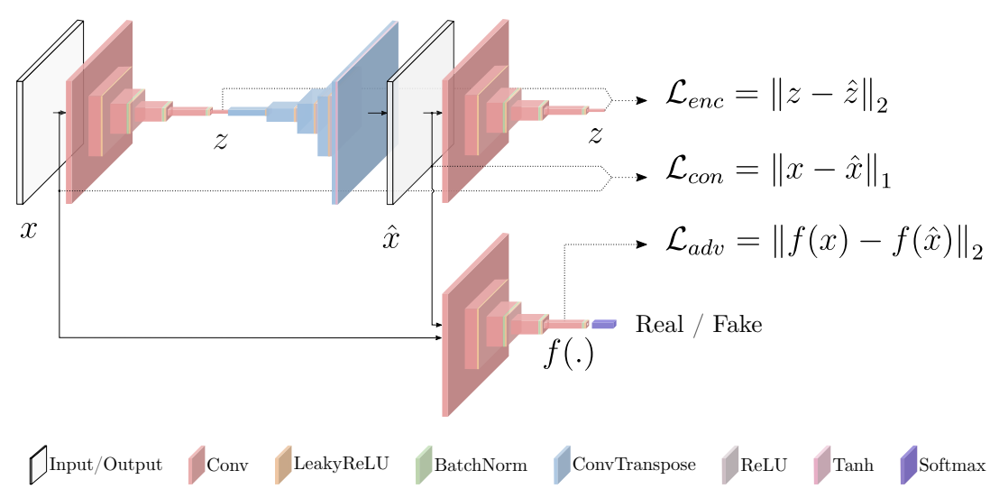
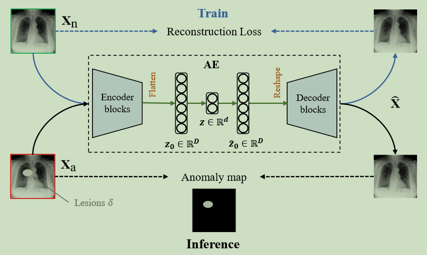
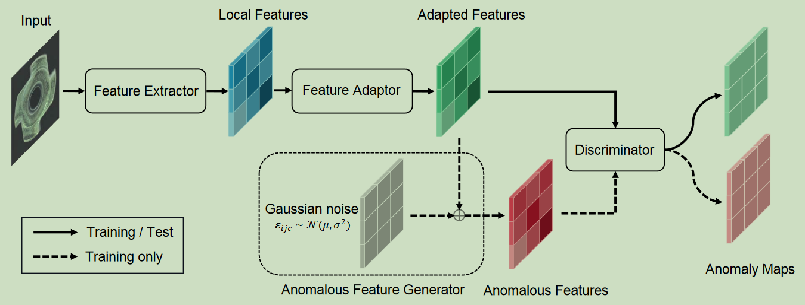

# 异常检测

## 一、概述

### 1、无监督

通常认为，正常样本之间分布相近，而异常样本和正常样本分布相隔较远，简单来说，异常样本可认为是正常样本的离群点。

传统的方法就是衡量相似度(proximity)。比如：**距离、密度、角度、隔离所需的难度、基于簇的方法**等，这些算法在低维上其实表现都接近，因为核心假设都是“异常点的表示与正常点不同，是少数派”。但大部分类似的算法都会面临维数灾难q(the curse of dimensionality)，即常见的相似性度量(比如欧氏距离)在高维数据上往往会失效。为了解决这个问题，人们提出了很多方法包括:

- 降维或者特征选择
- subspace方法，比如在多个低维空间上做检测再合并（如 random projection）
- 用 graph 来表示关系，提取特征
- 找 intrinsic dimensionality 以及其他度量方法

简单来说，对于高维度数据，中心思想还是找一个好的`空间/表示`。

为了找到更好的表示，对于线性降维可采用 `PCA`，对于非线性降维可采用 `autoencoder`。核心假设都是降维模型所找到的低维空间主要收到正常点的影响，因此异常点所找到的低维空间的距离更远。在此基础上引入了 `VAE`、`GAN`。

### 2、异常检测

> 异常检测（Anomaly Detection）是计算机视觉中的一个经典问题，生活中大部分的数据是正常数据，有很少一部分属于异常数据。在很少的异常下如何检测出异常是一个非常困难的课题。

在计算机视觉上大部分的检测任务前提是需要大量的标记数据做训练，这虽然在成本上耗费巨大，但是在实验效果上确实有很大的突破。

> 在庞大的目标检测背景下，**异常检测算是一个特里独行的分支，虽然只是判断正常和异常两种情况（二分类问题），但是往往异常样本特别的少**，如果从特征提取上区分正常和异常的话，由于训练样本过少或者说是训练样本比例不太平衡（正常样本特别多）往往会导致实验结果上不尽如人意。
>

## 二、现有方法

### 1、GANomaly（2018）

如上图所示，不同于一般的基于自编码器的方法，本文采用的是一个编码器(Encoder1)-解码器(Decoder)-编码器(Encoder2)的网络结构，同时学习“原图->重建图”和“原图的编码->重建图的编码”两个映射关系。该方法不仅对生成的图片外观（图片->图片）做了的约束，也对图片内容（图片编码->图片编码）做了约束。另外，该方法还引入了生成对抗网络（GAN）中的对抗训练思想。这里，作者将Encoder1-Decoder-Encoder2当成生成网络G-Net，又定义了一个判别网络D-Net，通过交替训练生成网络和对抗网络，最终学到一个比较好的生成网络。

### 2、Rethinking Autoencoders for Medical Anomaly Detection from A Theoretical Perspective（2024）

有部分方法，使用基于重建的方法，尤其是利用自动编码器（Autoencoder）的方法，在该领域占据主导地位。它们的工作原理是假设仅在正常数据进行训练的AE无法重建未见过的异常区域，从而将重建误差用于指示异常。然而，由于重建任务的训练目标与异常检测任务的目标不匹配，这种假设并不总是成立，导致这些方法在理论上不合理。

如上图所示，自编码器（记作 $\phi$）由编码器和解码器组成，编码器将图像压缩成一个紧凑的隐向量 $z$，解码器将隐向量 $z$ 重新映射到图像域。

正常图像 $Z_n$，异常图像 $Z_a$ 可看作其对应的正常版本加上病灶区域 $\delta$，即：$X_a=X_n+\delta$。基于AE的异常检测方法训练目标是最小化正常图像上的重建损失：
$$
\min E[\|\phi(X_n) − X_n\|^2]
$$
理想情况下，训练好的模型被希望实现以下目标：
$$
\hat{X_n}=\phi(X_n) \rightarrow X_n \\
\hat{X_a}=\phi(X_a)=\phi(X_n+\delta)\rightarrow X_n
$$
训练目标鼓励AE生成与模型输入相同的重建结果，但是推理阶段异常图像的理想重建结果与模型输入不同。这种差异可能导致AE成功重建一些异常区域，从而产生假阴性预测。

### 3、SimpleNet（2023）

> 使用基于重建的方法、基于合成的方法和基于嵌入的方法是解决无监督异常检测问题的三个主要趋势：
>
> - `基于重建的方法：`假设仅用正常数据训练的深度网络不能准确地重建异常区域。将逐像素重建误差作为用于异常定位的异常分数。然而，这一假设可能并不总是成立的，有时网络可以很好地“泛化”，从而也可以很好的重建异常输入，从而导致错误检测。
> - `基于合成的方法：`通过对在无异常图像上生成的合成异常进行训练来估计正常和异常之间的决策边界。然而，合成的图像不够逼真。来自合成数据的特征可能会偏离正常特征很远，使用这种负样本进行训练可能会导致有松散边界的正常特征空间，这意味着模糊的缺陷可能会被包括在分布特征空间中。
> - `基于嵌入的方法：`基于嵌入的方法是一种常用的手段，用于将高维数据映射到低维空间中，以便更容易地识别异常点。基于嵌入的方法指的是：将图像送入模型，提取特征，并在特征空间中构造分界面/评分规则。与重构方法的主要不同在于，其不在[RGB图像](https://so.csdn.net/so/search?q=RGB图像&spm=1001.2101.3001.7020)空间而是在高维的特征空间中进行异常检测；与自监督的方法不同，其不过于依赖额外的负样本的构造 / 代理任务的设计，主要考虑的特征空间中的差异。([无监督异常检测领域最新研究进展-基于嵌入的方法](https://blog.csdn.net/qq_36560894/article/details/121589041))

SimpleNet 由一个特征提取器、一个特征适配器、一个异常特征生成器和一个鉴别器组成：

- `特征适配器：`产生面向目标的特征，而不是直接使用预训练的特征，这可以减少领域偏差。

在训练阶段，将正常样本输入到预先训练的特征提取器中，以获得局部特征。然后，利用特征适配器将预先训练的特征适配到目标域中。通过将高斯噪声添加到自适应特征中来合成异常特征。自适应特征和异常特征分别用作正样本和负样本来训练最终的鉴别器。异常特征生成器在推断时被移除。

