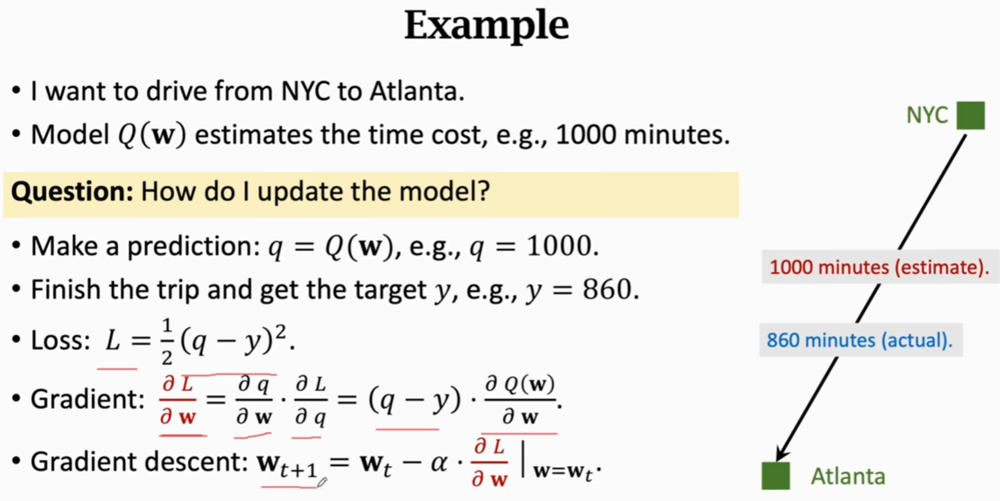
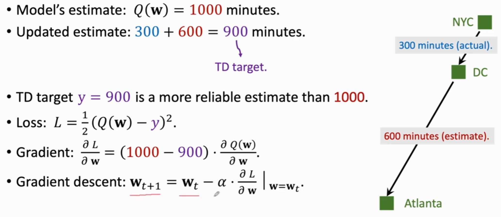
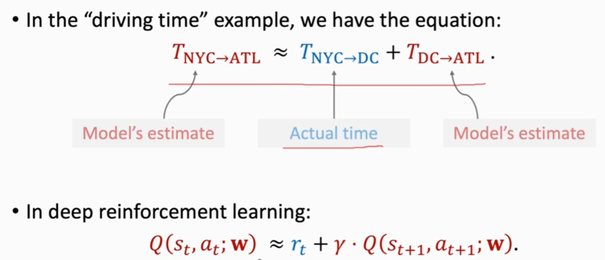
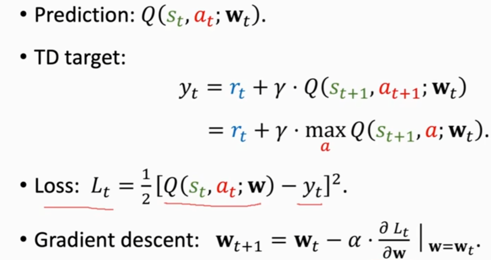
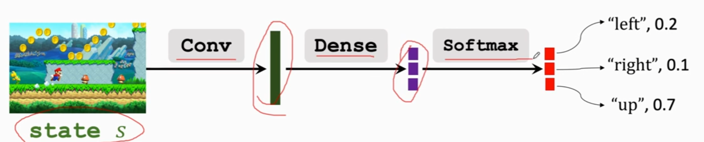
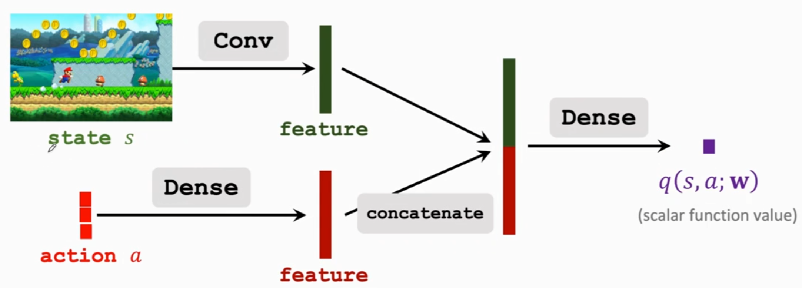
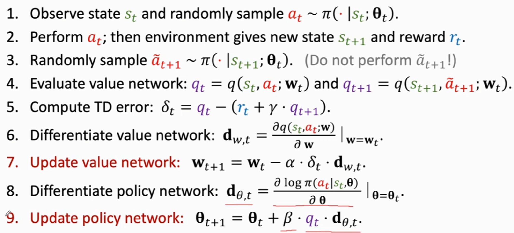

# 强化学习（1）

## 一、Play CartPole Game

```py
import gym
env = gym.make('CartPole-v0')

state = env.reset()

for t in range(100):
    env.render()
    print(state)
    
    action = env.action_space.sample()
    state, reward, done, info = env.step(action)
    
    if done:
        print('finished')
        break
        
env.close()
```

## 二、TD Learning









  

## 三、Actor-critic method

### 3.1、Policy network(Actor)



### 3.2、Value network(Critic)



### 3.3、Training


