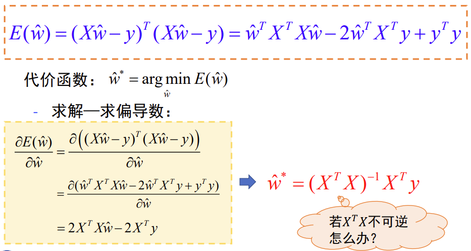
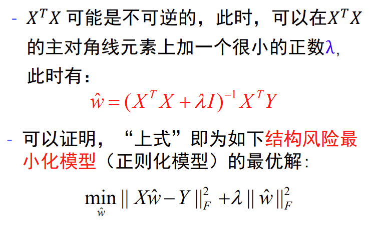
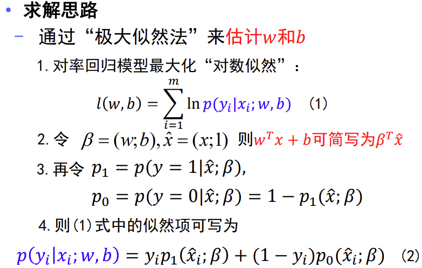
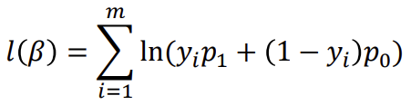
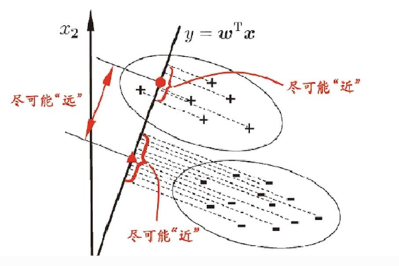
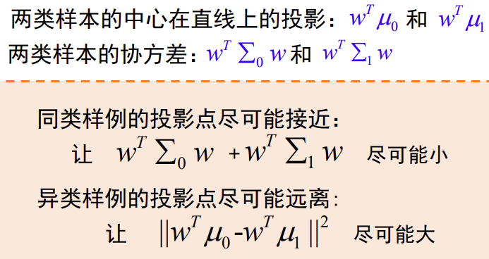
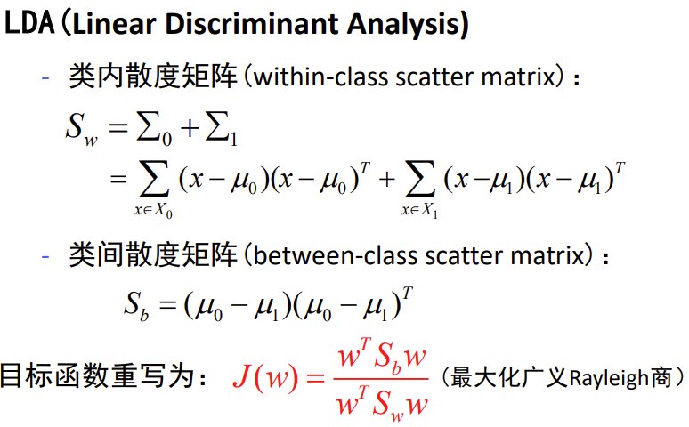
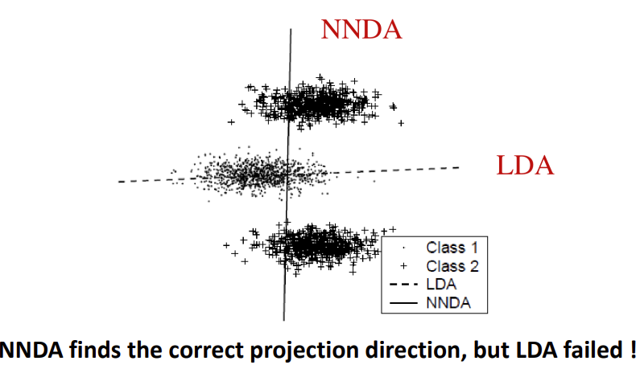
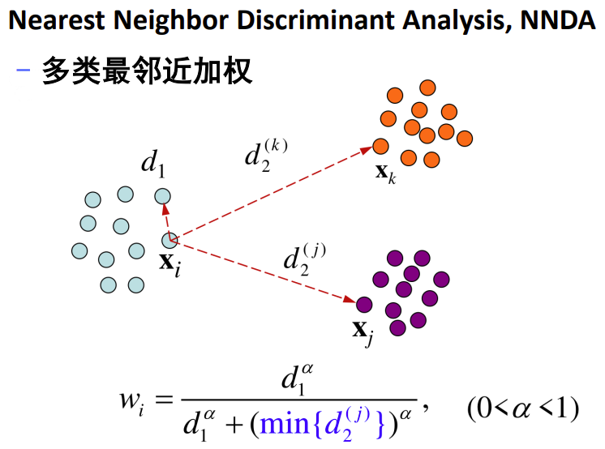
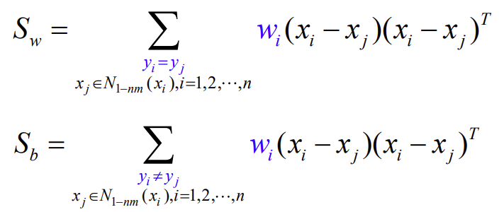

# 机器学习（一）

## 一、机器学习类型

### 1、监督学习

> 机器学习的数据是带标记的。标记作为预期效果，不断修正预测结果。

### 2、无监督学习

> 机器学习的数据是没有标记的。机器从无标记的数据中探索并推断出潜在的联系。

### 3、半监督学习

> 机器学习的数据，一部分是标记过的，而大部分是没有标记的。半监督学习的成本较低，又可以获得较高的准确度。

### 4、强化学习

> 智能体（Agent）以“试错”的方式进行学习，通过与环境进行交互获得的奖赏指导行为，目标是使智能体获得最大的奖赏。

## 二、基本概念

### 1、假设空间

> 监督学习的目的在于学习一个由输入到输出的映射，这一映射由模型来表达。

模型属于由输入空间到输出空间的映射的集合，这个集合就是假设空间。

### 2、机器学习三要素

`方法=模型+策略+算法`

**模型**

- 在监督学习中，模型就是所要学习的条件概率分布或决策函数
- 模型的假设空间包含所有可能的条件概率分布或决策函数

**策略**：按照什么样的准则学习或选择最优模型

- 结构风险：结构风险是在经验风险上加上表示模型复杂度的正则化项或惩罚项

  $R_{s r m}(f)=\frac{1}{n} \sum_{i=1}^n L\left(y_i, f\left(x_i\right)\right)+\lambda J(f)$

**算法**：求解最优化问题找到全局最优解

## 三、线性模型

### 1、线性回归

#### 1.1、多元线性回归

#### 1.2、广义线性回归

> 令预测值逼近y的衍生物，即y的函数

比如，输出标记是在对数尺度上的变化：$\ln{y}=w^Tx+b$。

上式称为对数线性回归。

更一般的，有$y=g^{-1}(w^Tx+b)$。

#### 1.3、对数几率回归

> 利用广义线性回归的思想，希望找到一个单调可微函数，利用该函数将分类任务的真实标记与线性回归模型的预测值联系起来。
>
> **几率(odds)：**度量样本x作为正例的相对可能性。y视为样本x作为正例的可能性,1-y就是反例的可能性

$\ln{\frac{y}{1-y}}=w^Tx+b$

#### 1.4、线性判别分析

> 对于二类分类问题，给定训练集，设法将样例投影到一条直线上，使得同类样例的投影点尽可能接近，不同类样例的投影点尽可能相互远离。

**局部线性判别分析**

