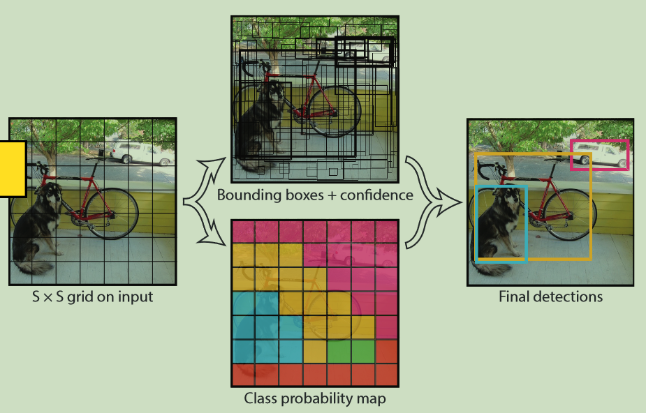
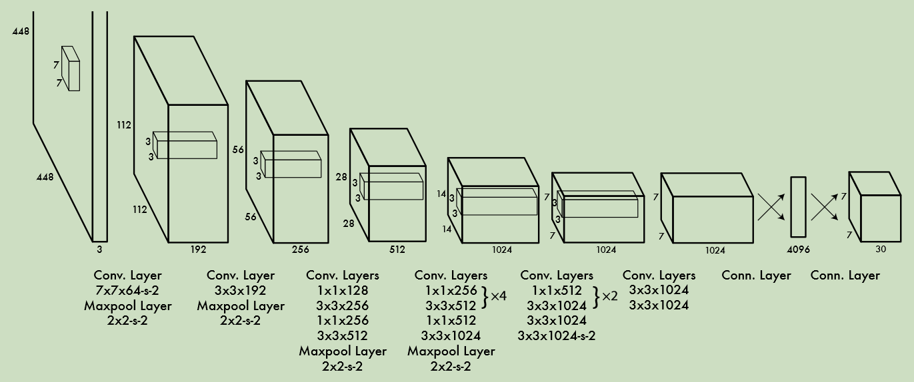

# YOLO系列

### 1、YOLO v1

- 将一幅图像分成SxS个网格(grid cell)，如果某个object的中心 落在这个网格中，则这个网格就负责预测这个object。

  

- 每个网络需要预测B个BBox的位置信息和confidence（置信度）信息，一个BBox对应着四个位置信息和一个confidence信息。confidence代表了所预测的box中含有object的置信度和这个box预测的有多准两重信息：$Pr(Object)*IOU_{pred}^{truth}$。

- 每个bounding box要预测(x, y, w, h)和confidence共5个值，每个网格还要预测一个类别信息，记为C类。则SxS个网格，每个网格要预测B个bounding box还要预测C个categories。输出就是S x S x (5*B+C)的一个tensor。

- 举例说明: 在PASCAL VOC中，图像输入为[448x448](https://www.zhihu.com/search?q=448x448&search_source=Entity&hybrid_search_source=Entity&hybrid_search_extra={"sourceType"%3A"article"%2C"sourceId"%3A362758477})，取S=7，B=2，一共有20个类别(C=20)。则输出就是[7x7x30](https://www.zhihu.com/search?q=7x7x30&search_source=Entity&hybrid_search_source=Entity&hybrid_search_extra={"sourceType"%3A"article"%2C"sourceId"%3A362758477})的一个tensor。整个网络结构如下图所示：

  

- 在test的时候，每个网格预测的class信息和bounding box预测的confidence信息相乘，就得到每个bounding box的class-specific confidence score：
  $$
  \Pr(Class_i|Object)*\Pr(Object)*IOU_{pred}^{truth} = \Pr(Class_i)*IOU_{pred}^{truth}
  $$
  

- 得到每个box的class-specific confidence score以后，设置阈值，滤掉得分低的[boxes](https://www.zhihu.com/search?q=boxes&search_source=Entity&hybrid_search_source=Entity&hybrid_search_extra={"sourceType"%3A"article"%2C"sourceId"%3A362758477})，对保留的boxes进行NMS处理，就得到最终的检测结果。

**损失函数**

作者全部采用了 `sum-squard error loss` 来作为损失函数。这存在一些问题：

- 将定位的error和分类的error看作同等重要显然是不合理的。
- 如果一个图中没有object的网格很多，那么就会将这些网格中box的confidence趋向于0，这会导致网络不稳定甚至发散。

解决方法：

- 更重视8维的坐标预测，给这些损失前面赋予更大的loss weight。
- 对没有object的box的confidence loss，赋予小的loss weight。
- 有object的box的confidence loss和类别的loss的loss weight正常取1。

**存在的问题**

- 由于输出层为全连接层，因此在检测时，YOLO训练模型只支持与训练图像相同的输入分辨率。
- 虽然每个格子可以预测B个bounding box，但是最终只选择只选择IOU最高的bounding box作为物体检测输出，即每个格子最多只预测出一个物体。