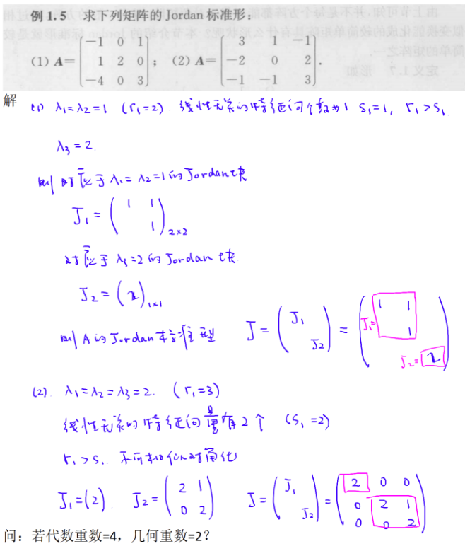
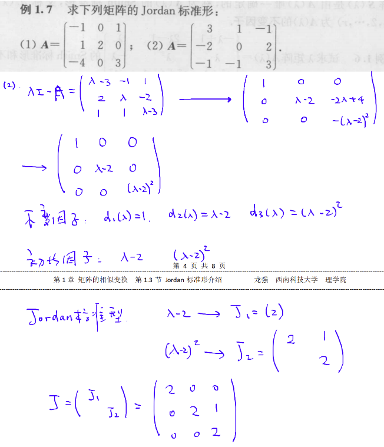
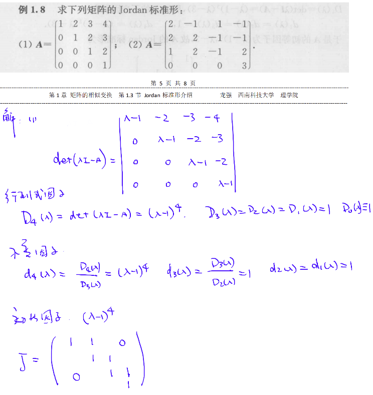

# Jordan 标准型

## 一、Jordan 标准形介绍

### 1、Jordan 标准形定义

> 定义 1.7 形如
> $$
> \boldsymbol{J}_i=\left(\begin{array}{cccc}
> \lambda_i & 1 & & \\
> & \lambda_i & \ddots & \\
> & & \ddots & 1 \\
> & & & \lambda_i
> \end{array}\right)_{r_i r_i}
> $$
>
> 的矩阵称为 $r_i$ 阶 Jordan 块, 由若干个 Jordan 块构成的分块对角矩阵
> $$
> \boldsymbol{J}=\left(\begin{array}{llll}
> \boldsymbol{J}_1 & & & \\
> & \boldsymbol{J}_2 & & \\
> & & \ddots & \\
> & & & J_s
> \end{array}\right)
> $$
>
> 称为 Jordan 矩阵.
> Jordan 矩阵与对角矩阵的差别仅在于它的上对角线 (与主对角线平行的上面一条对角线)的元素是 1 或 0 ,因此它是一个特殊的上三角阵. 显然, Jordan块本身就是一个 Jordan 矩阵. 对角矩阵也是一个 Jordan 矩阵, 它的每个 Jordan 块是一阶的.

`定理1.9` 设 $\boldsymbol{A} \in \mathrm{C}^{n \times n}$, 则 $\boldsymbol{A}$ 与一个Jordan 矩阵 $\boldsymbol{J}$ 相似, 即存在 $\boldsymbol{P} \in$ $\mathrm{C}_n^{n \times n}$, 使得 $\boldsymbol{P}^{-1} \boldsymbol{A P}=\boldsymbol{J}$. 这个 Jordan 矩阵 $\boldsymbol{J}$ 除 Jordan 块的排列次序外由 $\boldsymbol{A}$ 唯一确定，称 $\boldsymbol{J}$ 为 $\boldsymbol{A}$ 的 Jordan 标准形.

因为相似矩阵有相同的特征值, 所以 Jordan 标准形 $J$ 的对角元素 $\lambda_1, \lambda_2, \cdots, \lambda_s$就是 $\boldsymbol{A}$ 的特征值. 需要注意的是, 在 Jordan 标准形 $\boldsymbol{J}$ 中, 不同 Jordan 块的对角元素 $\lambda_i$ 可能相同,因此 $\lambda_i$ 不一定就是 $\boldsymbol{A}$ 的 $r_i$ 重特征值. 一般地,特征值 $\lambda_i$ 的重数大于或等于 $r_i$.

### 2、特征向量法

> 设 $\boldsymbol{A} \in \mathbf{C}^{n \times n}$. 如果 $\lambda_i$ 是 $\boldsymbol{A}$ 的单特征值, 则对应一阶 Jordan 块 $\boldsymbol{J}_i=\left(\lambda_i\right)$; 如果 $\lambda_i$是 $\boldsymbol{A}$ 的 $r_i\left(r_i>1\right)$ 重特征值, 则对应 $\lambda_i$ 有几个线性无关的特征向量, 就有几个以 $\lambda_i$ 为对角元素的 Jordan 块, 这些 Jordan 块的阶数之和等于 $r_i$. 由 $\boldsymbol{A}$ 的所有特征值对应的 Jordan 块构成的 Jordan 矩阵即为 $\boldsymbol{A}$ 的 Jordan 标准形. 这就是特征向量法,举例说明如下.

若代数重数为 4，几何重数为 2，则不可化为Jordan标准型，因为不能确定 J1 和 J2 都为二阶，还是其中之一为一阶，另一个为三阶。

### 3、初等变换法

> 定义 1.8 设 $\boldsymbol{A}(\lambda)=\left(a_{i j}(\lambda)\right)_{m \times n}$, 其中 $a_{i j}(\lambda)$ 都是 $\lambda$ 的多项式, 则称 $\boldsymbol{A}(\lambda)$ 是 $\boldsymbol{\lambda}$矩阵或多项式矩阵. 对 $\lambda$ 矩阵进行的如下三种变换称为 $\lambda$ 矩阵的初等行 (列) 变换:
> (1) 交换两行(列)（交换 $i, j$ 两行(列)，记作 $\left.\mathrm{r}_i \leftrightarrow \mathrm{r}_j\left(\mathrm{c}_i \leftrightarrow \mathrm{c}_j\right)\right)$;
> (2) 数 $k(k \neq 0)$ 乘某行(列) 的所有元素 (第 $i$ 行(列) 乘 $k$, 记作 $\mathrm{r}_i \times k\left(\mathrm{c}_i \times k\right)$ );
> (3) 把某一行(列)所有元素的 $\varphi(\lambda)$ 倍加到另一行(列)对应的元素上去, 其中 $\varphi(\lambda)$ 是一个多项式 (第 $j$ 行 (列) 的 $\varphi(\lambda)$ 倍加到第 $i$ 行 (列) 上, 记作 $\left.\mathrm{r}_i+\varphi(\lambda) \mathrm{r}_j\left(\mathrm{c}_i+\varphi(\lambda) \mathrm{c}_j\right)\right)$.

定理 1.10 秩为 $r$ 的 $\lambda$ 矩阵 $\boldsymbol{A}(\lambda)=\left(a_{i j}(\lambda)\right)_{m \times n}$ 可通过初等变换化为如下形式的矩阵
$$
\boldsymbol{S}(\lambda)=\left(\begin{array}{cccc:c}d_1(\lambda) & & & \\ & d_2(\lambda) & & & \boldsymbol{O} \\ & & \ddots & & \\ & & & d_r(\lambda) & \\ & \boldsymbol{O} & & & \boldsymbol{O}\end{array}\right)
$$
其中 $d_i(\lambda)(i=1,2, \cdots, r)$ 都是首一多项式, 且
$$
d_i(\lambda) \mid d_{i+1}(\lambda) \quad(i=1,2, \cdots, r-1) .
$$
$\lambda$ 矩阵 $\boldsymbol{S}(\lambda)$ 是由 $\boldsymbol{A}(\lambda)$ 唯一确定的, 称为 $\boldsymbol{A}(\lambda)$ 的 Smith 标准形, 又称 $d_i(\lambda)$ $(i=1,2, \cdots, r)$ 为 $\boldsymbol{A}(\lambda)$ 的不变因子.

**初等变化法步骤:**
第一步: 用初等变换化特征矩阵 $\lambda \boldsymbol{I}-\boldsymbol{A}$ 为 Smith 标准形,求出不变因子 $d_1(\lambda)$,变因子);

第二步: 将 $\boldsymbol{A}$ 的每个次数大于零的不变因子 $d_i(\lambda)$ 分解为互不相同的一次因式方幂的乘积, 这些一次因式的方幂称为 $\boldsymbol{A}$ 的初等因子, 设 $\boldsymbol{A}$ 的全部初等因子为复数 $\quad\left(\lambda-\lambda_1\right)^{r_1},\left(\lambda-\lambda_2\right)^{r_2}, \cdots,\left(\lambda-\lambda_s\right)^{r_s}$,其中 $\lambda_1, \lambda_2, \cdots, \lambda_s$ 可能有相同的,且 $r_1+r_2+\cdots+r_s=n$;
第三步:写出每个初等因子 $\left(\lambda-\lambda_i\right)^{r_i}(i=1,2, \cdots, s)$ 对应的 Jordan 块
$$
J_i=\left(\begin{array}{cccc}
\lambda_i & 1 & & \\
& \lambda_i & \ddots & \\
& & \ddots & 1 \\
& & & \lambda_i
\end{array}\right)_{r_i \times r_i} \quad(i=1,2, \cdots, s),
$$

以这些 Jordan 块构成的 Jordan 矩阵
$$
\boldsymbol{J}=\left(\begin{array}{llll}
\boldsymbol{J}_1 & & & \\
& \boldsymbol{J}_2 & & \\
& & \ddots & \\
& & & \boldsymbol{J}_s
\end{array}\right)
$$

即为 $\boldsymbol{A}$ 的 Jordan 标准形.

### 4、行列式因子法

> `定义 1.9` 设 $\lambda$ 矩阵 $\boldsymbol{A}(\lambda)$ 的秩为 $r$. 对于正整数 $k(1 \leqslant k \leqslant r), \boldsymbol{A}(\lambda)$ 的全部 $k$ 阶子式的首-最大公因式 $D_k(\lambda)$ 弥为 $\boldsymbol{A}(\lambda)$ 的 $k$ 阶行列式因子.

行列式因子与不变因子的关系:
定理 1.11 设 $\boldsymbol{A}(\lambda)$ 是秩为 $r$ 的 $m \times n$ 矩阵, 则 $\boldsymbol{A}(\lambda)$ 的行列式因子 $D_k(\lambda)$ 为
$$
D_k(\lambda)=d_1(\lambda) d_2(\lambda) \cdots d_k(\lambda) \quad(k=1,2, \cdots, r),
$$

其中 $d_k(\lambda)(k=1,2, \cdots, r)$ 是 $\boldsymbol{A}(\lambda)$ 的不变因子. 于是
$$
d_1(\lambda)=D_1(\lambda), \quad d_2(\lambda)=\frac{D_2(\lambda)}{D_1(\lambda)}, \cdots, \quad d_r(\lambda)=\frac{D_r(\lambda)}{D_{r-1}(\lambda)} .
$$

用行列式因子法求 $\boldsymbol{A} \in \mathbf{C}^{n \times n}$ 的 Jordan 标准形的过程为: 先求出 $\lambda \boldsymbol{I}-\boldsymbol{A}$ 的 $n$ 个行列式因子 $D_k(\lambda)(k=1,2, \cdots, n)$; 再利用式 (1.3) 求出 $\boldsymbol{A}$ 的不变因子 $d_k(\lambda)(k=$ $1,2, \cdots, n)$, 继而求出 $\boldsymbol{A}$ 的初等因子和 Jordan 标准形.

